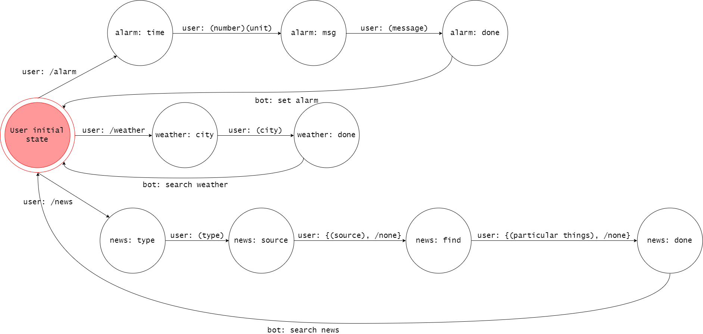
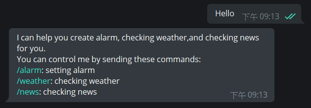
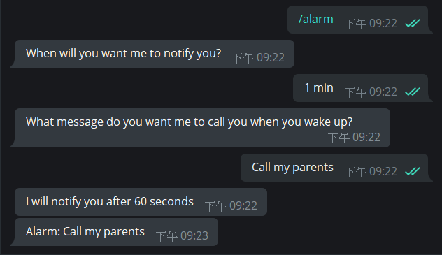
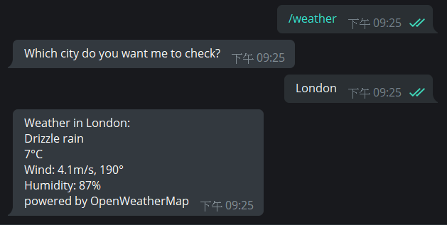
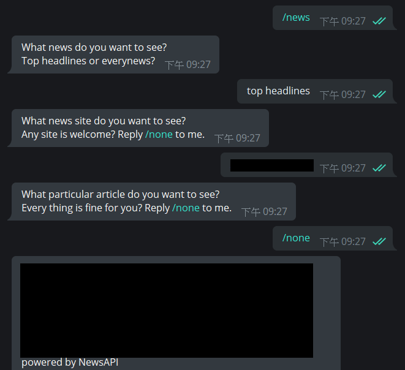

# Daily Assistant Bot - Homework: Theory of Computation

This homework implements the finite state machine by making a telegram bot.
This documentation follows the rule of teaching assistant's one.

## Setup

### Programming language requirement

* `python3`: This program is written in python

#### Python module requirement

* `flask`: version=0.12.2
* `python-telegram-bot`: version=9.0.0

You can run this code below to install these requirement

```shell
pip install -r requirements.txt
```

### Before you start

I listed the requirement secret code and tokens in the list. You have to change
it in order to run this code properly.

* `daily_assis_bot.py`:
  * `TELEGRAM_TOKEN`: Your telegram bot token, you will get this token
                      when you create a bot with
                      [botfather](https://telegram.me/botfather) in telegram.
  * `WEBHOOK_URL`: Your https server address.
* `weather.py`:
  * `APPID`: Your API key of [OpenWeatherMap](https://openweathermap.org/).
             You have to get it in order to use the `/weather` service.
* `news.py`:
  * `API_KEY`: Your API key of [NewsAPI](https://newsapi.org/).
               You have to get it in order to use the `/news` service.

### Execute the code locally

This program is used for telegram bot. An https server is required.
If you don't want to use https server, you can use `ngrok` as proxy.

Below shows the instruction of using `ngrok`

Download [ngrok](https://ngrok.com/) in their website.

Type the code in the command line below.

```shell
ngrok http 5000
```

`ngrok` will create a https URL. Replace `WEBHOOK_URL` in `daily_assis_bot.py`
with it.

#### Run the program

After everything is set up. Run the code below in the command line.

```shell
python daily_assis_bot.py
```

## Finite State Machine



## How to use this bot

The initial state is set to `user_initial_state`, in `daily_assis_bot.py`
the state is stored in `fsm_dictionary`.

Once the user answered a specific command. It will advance to the correspond
state. In each state, the bot will reply with the correspond message back to
user. If the user didn't reply the specific message, it will halt in the
current state.

If the user reaches the **done** state of the *state list*
(in `daily_assis_bot.py`, the value of `Step` in dictionary
`fsm_dictionary['chat_id']`), the bot will do the correspond work and the user
will go back to initial state.

* user initial state
  * user input: /alarm

    reply: When will you want me to notify you?
    * user input: (number)(unit)

      reply: What message do you want me to call you when you wake up?
      * user input: (message)

        reply: I will notify you after (number) seconds
  * user input: /weather

    reply: Which city do you want me to check?
    * user input: (city)

    reply: (weather ofthe city)
  * user input: "/news"

    reply: "What news do you want to see? Top headlines or everynews?"
    * user input: (news type)

      reply: What news site do you want to see? Any site is welcome? Reply
             /none to me.
      * user input: {(site source), /none}

        reply: What particular article do you want to see? Every thing is fine
               for you? Reply /none to me.
        * user input: {(particular thing), /none}

          reply: (news)

## Picture example

### Normal message



### Alarm



### Weather



### News


